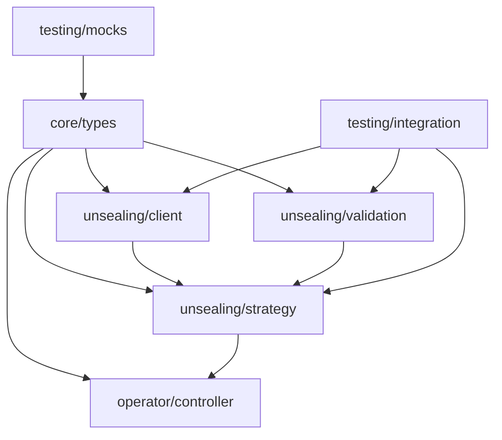

# Architecture Documentation

## Overview

The Vault Autounseal Operator has been refactored from a layer-based architecture to a **feature-based architecture**. This change improves code organization, maintainability, and domain separation.

## Previous Architecture (Layer-Based)

```
pkg/
├── api/v1/          # API layer
├── controller/      # Controller layer
└── vault/           # Vault client layer
```

**Problems with layer-based approach:**
- Cross-cutting concerns scattered across layers
- Business logic mixed with technical concerns
- Difficult to understand feature boundaries
- High coupling between layers

## New Architecture (Feature-Based)

```
pkg/
├── core/
│   ├── types/       # Core domain types and interfaces
│   └── config/      # Configuration management
├── unsealing/       # Vault unsealing feature
│   ├── client/      # Vault HTTP client
│   ├── strategy/    # Unsealing strategies (default, retry, parallel)
│   ├── validation/  # Key validation logic
│   └── metrics/     # Unsealing-specific metrics
├── operator/        # Kubernetes operator feature
│   ├── crd/         # Custom Resource Definitions
│   ├── controller/  # Kubernetes controllers
│   └── reconciler/  # Reconciliation logic
└── testing/         # Shared testing utilities
    ├── fixtures/    # Test fixtures and data
    ├── mocks/       # Mock implementations
    └── integration/ # Integration test framework
```

## Feature Breakdown

### 1. Core (`pkg/core/`)

**Purpose:** Foundational types and configuration shared across features.

- **`types/`**: Domain interfaces, error types, and core data structures
  - `interfaces.go`: Core interfaces (VaultClient, KeyValidator, UnsealStrategy, etc.)
  - `errors.go`: Custom error types with proper error handling

- **`config/`**: Application configuration management
  - Configuration loading and validation
  - Environment variable handling

### 2. Unsealing (`pkg/unsealing/`)

**Purpose:** Everything related to Vault unsealing operations.

- **`client/`**: Vault HTTP client implementation
  - `client.go`: Main Vault client with connection management
  - `client_test.go`: Client unit tests

- **`strategy/`**: Different unsealing approaches
  - `strategy.go`: Default, parallel, and retry unsealing strategies
  - `strategy_test.go`: Strategy pattern tests

- **`validation/`**: Key validation logic
  - `validator.go`: Default key validation
  - `strict_validator.go`: Enhanced validation with security rules
  - `validator_test.go`: Comprehensive validation tests

- **`metrics/`**: Unsealing-specific observability
  - Metrics collection for unsealing operations
  - Performance monitoring

### 3. Operator (`pkg/operator/`)

**Purpose:** Kubernetes operator-specific functionality.

- **`crd/`**: Custom Resource Definition handling
  - VaultUnsealConfig CRD types and validation

- **`controller/`**: Kubernetes controllers
  - Reconciliation logic for CRDs
  - Event handling and status updates

- **`reconciler/`**: Business logic for reconciliation
  - State management
  - Workflow orchestration

### 4. Testing (`pkg/testing/`)

**Purpose:** Shared testing utilities and frameworks.

- **`fixtures/`**: Test data and fixtures
  - Sample configurations
  - Test keys and certificates

- **`mocks/`**: Mock implementations
  - `mocks.go`: Testify-based mocks for all interfaces

- **`integration/`**: Integration testing framework
  - `testcontainers_suite.go`: Testcontainers-based integration tests
  - Shared test utilities and helpers

## Benefits of Feature-Based Architecture

### 1. **Domain Clarity**
- Each package represents a distinct business capability
- Clear boundaries between features
- Easier to understand system responsibilities

### 2. **Reduced Coupling**
- Features depend on core types/interfaces, not implementations
- Dependency injection through interfaces
- Easier to test in isolation

### 3. **Improved Maintainability**
- Related code is co-located
- Changes to a feature are contained within its package
- Easier to reason about feature completeness

### 4. **Better Testing**
- Each feature can be tested independently
- Clear separation of unit vs integration tests
- Shared testing utilities reduce duplication

### 5. **Scalability**
- New features can be added without affecting existing ones
- Team ownership can be assigned by feature
- Parallel development is easier

## Package Dependencies



## Interface Design

The architecture relies heavily on interfaces defined in `core/types`:

```go
type VaultClient interface {
    IsSealed(ctx context.Context) (bool, error)
    GetSealStatus(ctx context.Context) (*api.SealStatusResponse, error)
    Unseal(ctx context.Context, keys []string, threshold int) (*api.SealStatusResponse, error)
    // ... other methods
}

type UnsealStrategy interface {
    Unseal(ctx context.Context, client VaultClient, keys []string, threshold int) (*api.SealStatusResponse, error)
}

type KeyValidator interface {
    ValidateKeys(keys []string, threshold int) error
    ValidateBase64Key(key string) error
}
```

This design enables:
- **Dependency injection**: Easy to swap implementations
- **Testing**: Mock implementations for unit tests
- **Extensibility**: New strategies/validators without changing existing code

## Migration Guide

### For Existing Code

1. **Update imports**: Change from `pkg/vault` to specific feature packages:
   ```go
   // Old
   import "github.com/example/vault-operator/pkg/vault"

   // New
   import "github.com/example/vault-operator/pkg/unsealing/client"
   import "github.com/example/vault-operator/pkg/core/types"
   ```

2. **Interface usage**: Use interfaces from `core/types`:
   ```go
   // Old
   var client *vault.Client

   // New
   var client types.VaultClient
   ```

3. **Factory patterns**: Use dependency injection:
   ```go
   // Create client
   client := client.NewClient(endpoint, tlsSkip, timeout)

   // Create validator
   validator := validation.NewDefaultKeyValidator()

   // Create strategy with dependencies
   strategy := strategy.NewDefaultUnsealStrategy(validator, metrics)
   ```

### For Tests

1. **Use shared mocks**: Import from `testing/mocks`
2. **Integration tests**: Use `testing/integration` suite
3. **Unit tests**: Test individual features in isolation

## Future Enhancements

The new architecture enables several future improvements:

1. **Plugin system**: Easy to add new unsealing strategies
2. **Multi-backend support**: Different Vault backends as separate features
3. **Advanced observability**: Feature-specific metrics and tracing
4. **Configuration validation**: Enhanced config validation per feature
5. **Performance optimization**: Feature-specific optimizations

## Best Practices

1. **Keep features independent**: Avoid cross-feature dependencies
2. **Use interfaces**: Always depend on abstractions, not implementations
3. **Test at the right level**: Unit tests for individual features, integration tests for workflows
4. **Follow naming conventions**: Clear, descriptive package and type names
5. **Document interfaces**: Clear contracts for all public interfaces
